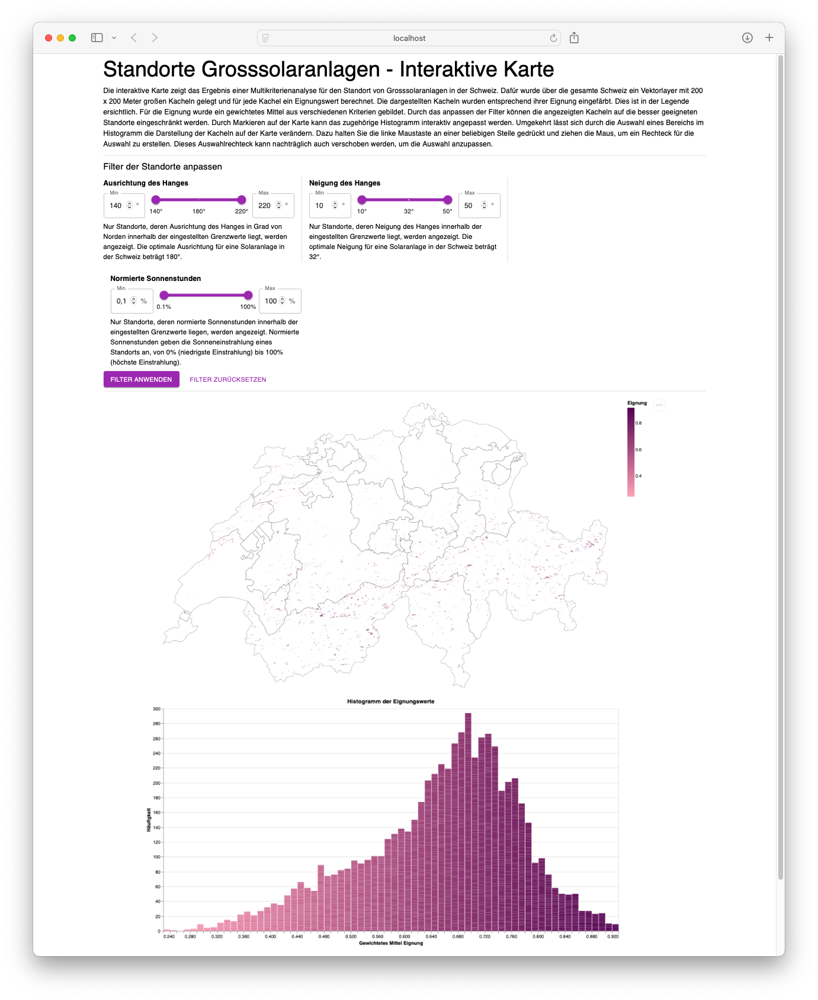

# Standorte Grosssolaranlagen - Interaktive Karte

Die interaktive Karte zeigt das Ergebnis einer Multikriterienanalyse für
den Standort von Grosssolaranlagen in der Schweiz. Dafür wurde über die
gesamte Schweiz ein Vektorlayer mit 200 x 200 Meter großen Kacheln
gelegt und für jede Kachel ein Eignungswert berechnet. Die dargestellten
Kacheln wurden entsprechend ihrer Eignung eingefärbt. Dies ist in der
Legende ersichtlich. Für die Eignung wurde ein gewichtetes Mittel aus
verschiedenen Kriterien gebildet. Durch das anpassen der Filter können
die angezeigten Kacheln auf die besser geeigneten Standorte
eingeschränkt werden. Durch Markieren auf der Karte kann das zugehörige
Histogramm interaktiv angepasst werden. Umgekehrt lässt sich durch die
Auswahl eines Bereichs im Histogramm die Darstellung der Kacheln auf der
Karte verändern. Dazu halten Sie die linke Maustaste an einer beliebigen
Stelle gedrückt und ziehen die Maus, um ein Rechteck für die Auswahl zu
erstellen. Dieses Auswahlrechteck kann nachträglich auch verschoben
werden, um die Auswahl anzupassen.



## Getting Started

First, create and activate a virtual environment:

```bash
python3 -m venv venv
source venv/bin/activate
```

Then, install the dependencies:

```bash
npm install
# or
yarn
# or
pnpm install
```

Then, run the development server(python dependencies will be installed automatically here):

```bash
npm run dev
# or
yarn dev
# or
pnpm dev
```

Open [http://localhost:3000](http://localhost:3000) with your browser to see the result.

The FastApi server will be running on [http://127.0.0.1:8000](http://127.0.0.1:8000) – feel free to change the port in `package.json` (you'll also need to update it in `next.config.js`).
